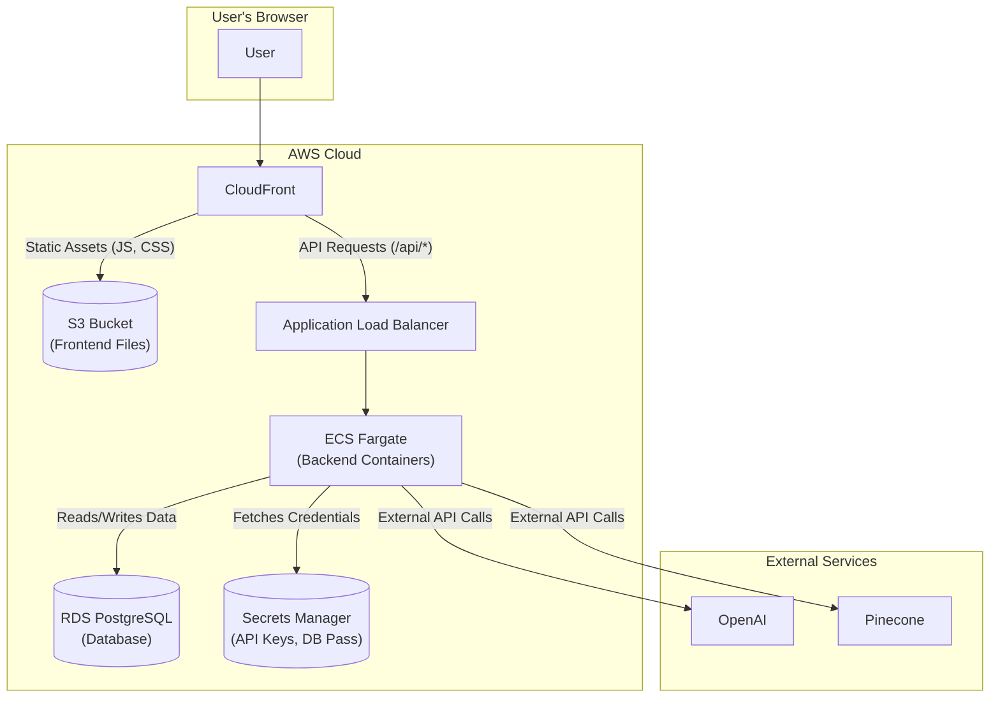

# AWS Deployment Design: Eloquent RAG Chatbot

This document outlines a production-ready deployment strategy for the Eloquent RAG Chatbot on Amazon Web Services (AWS). The architecture is designed to be scalable, secure, cost-effective, and easy to manage by leveraging modern DevOps practices and managed AWS services.

## 1. Core Architecture Overview

The architecture decouples the frontend, backend, and database, allowing each component to be scaled and managed independently. This separation is key to building a resilient and maintainable system.

### Architecture Diagram

### Data Flow

1.  A user visits the chatbot's domain name.
2.  **AWS CloudFront** serves the static Next.js frontend application, which is stored in an **S3 Bucket**. This is extremely fast and low-cost.
3.  The frontend, running in the user's browser, makes API calls (e.g., to `/api/chat` or `/api/sessions`).
4.  **CloudFront** is configured to route all traffic for the `/api/*` path to an **Application Load Balancer (ALB)**.
5.  The **ALB** securely distributes the incoming API requests across one or more running instances of the FastAPI backend Docker container.
6.  The backend containers are managed by **AWS Fargate**, a serverless container engine. Fargate automatically handles scaling, so if traffic increases, it adds more containers.
7.  The backend application connects to the **Amazon RDS PostgreSQL** database for all user, session, and message data.
8.  For RAG functionality, the backend makes secure API calls over the internet to the **Pinecone** and **OpenAI** services.

---

## 2. Key AWS Services & Justification

| Application Component | AWS Service Chosen | Why We're Using It |
| :-------------------- | :------------------------------------------------- | :----------------------------------------------------------------------------------------------------------------------------------------------------------------------------------------------------------------- |
| **Backend (FastAPI)** | **AWS Fargate (on ECS)** | > **Serverless Containers.** Fargate runs Docker containers without needing to manage servers. It automatically scales the number of backend containers to meet demand, ensuring high availability and cost-efficiency. |
| **Frontend (Next.js)** | **Amazon S3 + Amazon CloudFront** | > **High Performance & Low Cost.** S3 is a simple and durable object store for the static files generated by the Next.js build. CloudFront acts as a global CDN, caching the frontend close to users for instant load times. |
| **Database (Postgres)** | **Amazon RDS for PostgreSQL** | > **Managed & Reliable.** RDS automates difficult database tasks like patching, backups, and failover. This is significantly more secure and reliable than running a database in a Docker container for production. |
| **Networking & Routing** | **Application Load Balancer (ALB)** | > **Smart Traffic Distribution.** The ALB efficiently routes API traffic to healthy backend containers. It's essential for enabling scalability and performing zero-downtime deployments. |
| **Secrets Management** | **AWS Secrets Manager** | > **Secure Credentials.** All sensitive data (`LLM_API_KEY`, `POSTGRES_URL`, `JWT_SECRET`) is stored securely in Secrets Manager, not in code or environment variables. The Fargate task is granted IAM permissions to fetch them at runtime. |
| **Container Images** | **Amazon ECR** | > **Private Docker Registry.** ECR (Elastic Container Registry) is a private and secure AWS-managed repository where we will store our backend and frontend Docker images after they are built. |

---

## 3. DevOps & Best Practices

### Environment Configuration

The application's design, which uses `pydantic-settings` to load from the environment, aligns perfectly with AWS best practices.

-   **No Hardcoded Secrets:** Sensitive values are stored in **AWS Secrets Manager**. The ECS Task Definition for the Fargate service is configured to securely inject these secrets into the container's environment at startup.
-   **Environment Isolation:** To test changes safely, we would create separate environments (e.g., **Staging** and **Production**), each within its own AWS account or VPC. Each environment has its own independent set of resources (database, Fargate service, secrets), preventing cross-contamination.

### CI/CD Pipeline (Deployment Automation)

A CI/CD pipeline, using a tool like **GitHub Actions**, would be implemented to automate deployments and reduce human error.

The workflow would be:
1.  **Commit:** A developer pushes code to the `main` branch on GitHub.
2.  **Build:** A GitHub Actions workflow triggers, building the `backend` and `frontend` Docker images.
3.  **Push:** The new images are tagged and pushed to **Amazon ECR**.
4.  **Deploy:** The workflow instructs AWS Fargate to perform a rolling update, gradually replacing old containers with new ones to ensure zero downtime. For the frontend, it syncs the new build files to the S3 bucket and invalidates the CloudFront cache.

### Security & Logging

-   **Network Security:** All resources (Fargate, RDS, ALB) are deployed within a **Virtual Private Cloud (VPC)** to isolate them from the public internet. **Security Groups** act as virtual firewalls, ensuring that only the ALB can receive public traffic and only the Fargate containers can connect to the RDS database.
-   **Centralized Logging:** The Fargate service is configured to stream all application logs (stdout/stderr from FastAPI) directly to **Amazon CloudWatch Logs**. This creates a centralized, searchable log repository for monitoring and debugging.